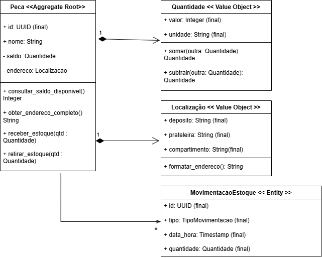

# Inventory Domain Model - SAP ABAP Cloud

## 🎯 Objetivo do Projeto
Este repositório documenta a implementação de um **Modelo de Domínio** para gestão de inventário, desenvolvido como parte do meu plano de especialização de 24 meses em **SAP ABAP Cloud**. O foco aqui é demonstrar a aplicação de padrões de **Engenharia de Software** e **DDD (Domain-Driven Design)** no ecossistema SAP moderno.

## 🏗️ Arquitetura do Domínio
O projeto foi modelado utilizando conceitos de **Clean ABAP** e separação de responsabilidades:

- **Peca (Aggregate Root)**: Entidade principal que encapsula o estado do material e garante a integridade do saldo através de métodos de negócio.
- **Quantidade (Value Object)**: Objeto imutável que gerencia valores numéricos e unidades de medida, evitando erros de cálculo primitivo.
- **Movimentação (Entity)**: Registro histórico de todas as entradas e saídas, garantindo rastreabilidade total.

## 🛠️ Tecnologias e Padrões
- **Linguagem**: ABAP Cloud (foco em BTP e ADT).
- **Ambiente**: Desenvolvido com ABAP BTP Cloud environment.
- **Conceitos**: Encapsulamento, Imutabilidade, e Domain-Driven Design.
- **Referência**: Implementação inspirada em padrões de arquitetura Java para garantir alta manutenibilidade.

## 📈 Plano de Estudos (24 Meses)
Este projeto é um marco na minha transição de **Java** para o ecossistema SAP, com foco em:
- [x] Modelagem de Domínio com ABAP Objects.
- [ ] Implementação de Persistence (RAP/Fiori).
- [ ] Administração e Performance em SLES 16.
